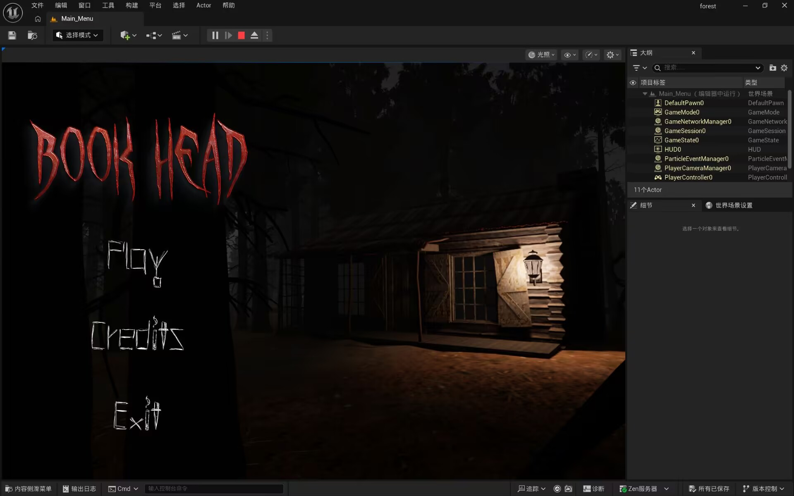
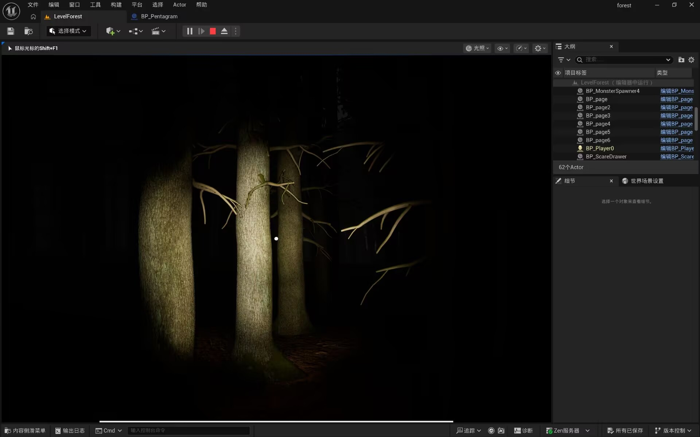
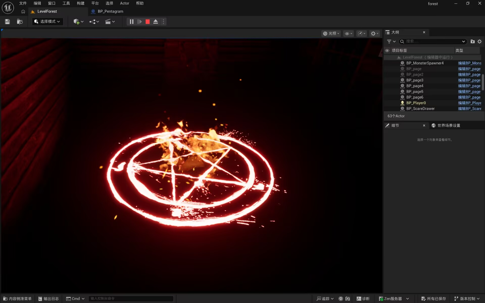

## ? 游戏简介
耗时三天制作的恐怖游戏Demo，应该是我制作的第一款有头有尾的游戏？

你需要在一座阴森的森林里收集散落各处的书页，并最终在上锁的小屋中完成仪式以击杀怪物。途中，你必须时刻躲避怪物的追击。

**游戏流程：** 约10分钟

## ? 游戏特性
*   沉浸式恐怖氛围
*   紧张的追逐战
*   收集与解密元素

## ?? 游戏截图
| 截图 | 说明 |
| :---: | :---: |
|  | 开始界面 |
|  | 在森林中躲避怪物 |
|  | 小屋中完成仪式 |

## ? 备注
这是第一款自己制作的完整游戏，算是入坑游戏开发的一个里程碑。